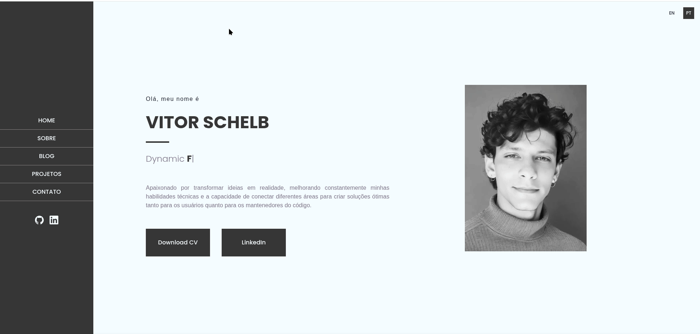
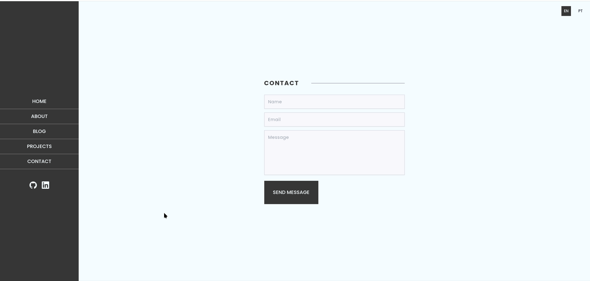

# Personal Portfolio — Vitor Schelb

A professional portfolio built with **Next.js**, **TypeScript**, and **Tailwind CSS**, designed to showcase projects, skills, and experience in an accessible, fluid, and multilingual way.


---

## Screenshots

<div align="center">
  
  <br/><br/>
  
  <br/><br/>
  
</div>

---

## Features

- **Responsive Design** — Fully adapted for mobile, tablet, and desktop.
- **Internationalization (i18n)** — Full support for **Portuguese (pt)** and **English (en)**, with dynamic language switching via `next-intl`.
- **Smooth Animations** — Page transitions and typing effects powered by `framer-motion` and `typed.js`.
- **Project Carousel** — Intuitive project navigation with `swiper`.
- **Contact Form** — Integrated message sending with `nodemailer`.
- **Accessibility** — Focus on intuitive navigation, contrast, and semantic HTML.
- **Image Optimization** — Using `next/image` and `sharp` for fast loading.
- **Reusable Components & Theming** — UI built with `Chakra UI`, `Radix UI`, and `Tailwind CSS`.

---

## Tech Stack

- [Next.js](https://nextjs.org/) — React framework with App Router
- [React](https://react.dev/) — Library for declarative UIs
- [TypeScript](https://www.typescriptlang.org/) — Static typing
- [Tailwind CSS](https://tailwindcss.com/) — Utility-first CSS
- [Chakra UI](https://chakra-ui.com/) — Accessible components
- [Framer Motion](https://www.framer.com/motion/) — Declarative animations
- [next-intl](https://next-intl-docs.vercel.app/) — Internationalization
- [Swiper](https://swiperjs.com/) — Touch-friendly carousel
- [Nodemailer](https://nodemailer.com/) — Email sending
- [Zod](https://zod.dev/) — Schema validation

---

## Internationalization (i18n)

This project was built with a global audience in mind. All textual content is externalized into JSON files located in `/messages`:

```
messages/
├── en.json   # English
└── pt.json   # Portuguese
```

Routes are automatically generated in the `/[locale]/` format, enabling URLs like:
- `/pt` — Portuguese version
- `/en` — English version

Language switching can be done via toggle components present in the sidebar (desktop) and navbar (mobile).

---

## Project Structure

```
├── app/
│   ├── [locale]/          # Internationalized routes
│   │   ├── page.tsx         # Home page (Hero)
│   │   ├── about/
│   │   ├── projects/
│   │   ├── blog/
│   │   ├── contact/
│   │   └── components/      # Reusable components
│   ├── modules/             # Page sections (Hero, About, etc.)
│   └── contexts/            # React contexts
├── messages/                # Translations (pt, en)
├── public/                  # Static assets
│   └── screenshots/         # Project screenshots
├── i18n.ts                  # next-intl configuration
├── next.config.js           # Next.js configuration
├── tailwind.config.js       # Tailwind configuration
└── package.json
```

---

## Getting Started

### Prerequisites

- [Node.js](https://nodejs.org/) v18+
- npm (or yarn/pnpm)

### Installation

```bash
# Clone the repository
git clone https://github.com/vitorschelb/portfolio.git
cd portfolio

# Install dependencies
npm install
```

> **Note:** If you encounter peer dependency conflicts, the project has already been adjusted to use `typed.js` instead of `react-typed`, ensuring compatibility with React 18.

### Environment Variables

Create a `.env.local` file in the root with the following variables (required for the contact form):

```env
SMTP_HOST=your_smtp_host
SMTP_PORT=587
SMTP_USER=your_email
SMTP_PASS=your_password
CONTACT_EMAIL=destination_email
```

### Running in Development

```bash
npm run dev
```

Open [http://localhost:3000](http://localhost:3000) in your browser.

### Production Build

```bash
npm run build
npm start
```

---

## Author

**Vitor Schelb**

- [LinkedIn](https://www.linkedin.com/in/vitor-schelb-37b109124/)
- [GitHub](https://github.com/vitorschelb)

---

## License

This is a personal project under the MIT License.
